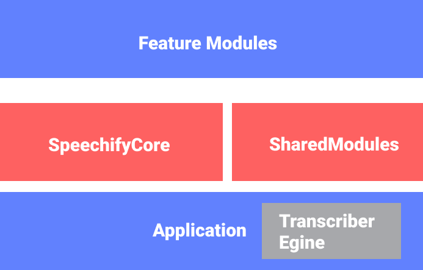
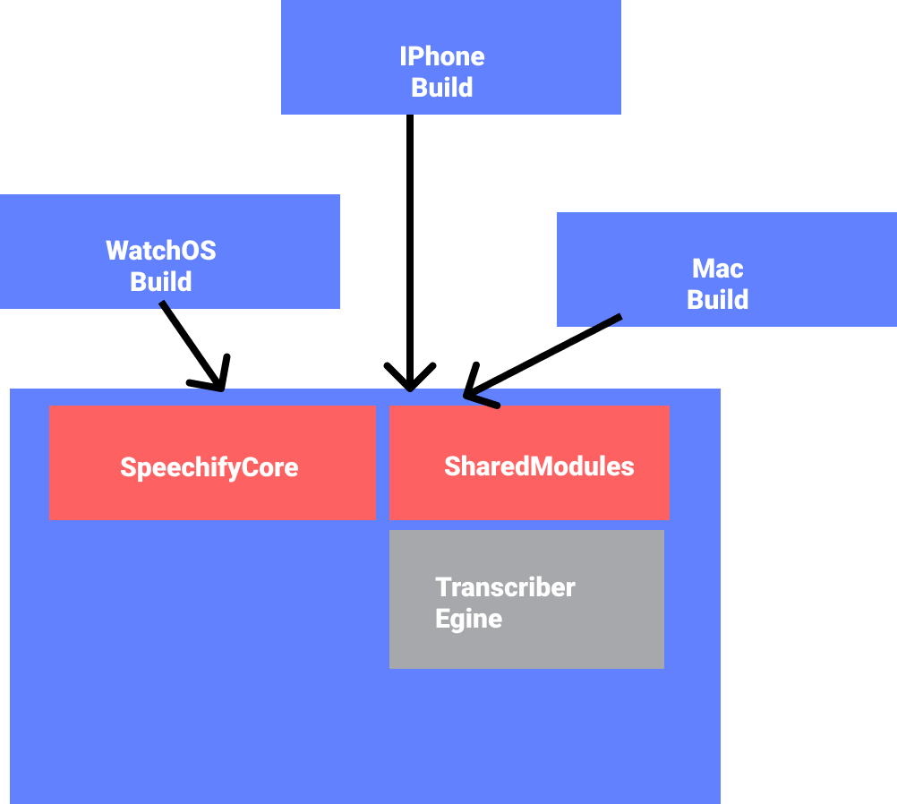

# **IOS AUDIO SUBMISSION DOCUMENTATION**

** TEST WITH A GOOD INTERNET SERVICE **

**Task description**

Develop an app that converts speech to text and allows for play back, with word highlighting.

**More unit / UI test will flow**

**Figma Link**

To properly design the screen taking into account color codes, text sizes, and margins. I developed a quick Figma design, link below

[https://www.figma.com/file/AptFfHYGQgLsqyTNQVkTRO/Untitled?node-id=0%3A1](https://www.figma.com/file/AptFfHYGQgLsqyTNQVkTRO/Untitled?node-id=0%3A1)

**Task requirements**

The following are the highlight of the requirement for the task

1. Reactive programming using combine.

2. MVVM architecture.

3. Modularity.

4. Implemented in swift UI.

**Core highlight**

1. Proper architecture: with the application growing in should be properly architected
2. Ability to scale application fast: the application should be reusable with the iOS ecosystem and provide rapid iterations
3. Multi developer ease: developer should be able to clearly understand, build and test in isolation

# Implementation details

**Architecture**

The application is built with SWIFTUI + Combine as the reactive framework. Furthermore, the architecture uses a modular MVVM structure.

MVVM highlights how each unit is implemented, while for the general outlook modular architecture was implemented using Swift packages. The image on the next page represents the application&#39;s architecture

A swift package(module) is a group of related source codes that can run independently, this modular approach provides the benefit of scalability, usability, and multi-developer ease.

**Scalability &amp; developer ease:** with the application growing, build time increases, source files become numerous. This modular approach i implemented allows the developer to concentrate on a section of the application, develop, build and test independent of the changes in the other modules.

**Rapid Iterations:** With this modular approach rapid iterations that require multi developers can easily be achieved, with each task tied to a particular module , allow for easy changes, test, and deployment. For example, a change in UI should only affect the feature module while other modules remain untouched and vice versa

**Usability:** IOS is becoming a complete ecosystem from watches to mac, mobile devices, etc. all interconnected with swift UI the speed of deployment to these platforms was greatly increase. Modular architecture allows the usability of each framework independent of UI requirements.. i.e the core functionality can be imported into the watchOS app, and while the UI is different

Furthermore, each module can be release and managed in a git bucket repository thus reducing the bulk source code overhead

**View Builder pattern**

With SwiftUI, navigation has been tightly coupled to the views, so Co-ordinator pattern though still achievable introduces a major boilerplate, the view builder pattern i introduce allows for the assignment of view building to a single class, thus provide a single source of truth for navigation and future changes in navigation flow. This is available in the MainViewBuilder class

**The benefit of modular architecture is numerous from the ease of onboarding new engineers. To rapid development and deployment.**

# **Task Modules and description**

**Feature:** This module will hold each individual feature of the application (Main, settings, user-management, etc).

**SharedUtils:** Holds all utils required within the application

**SharedUI:** UI components like buttons etc can be placed here.

**SharedResource** : location for application assets, localized strings

**SpeechifyExtension** : Location for shared extension, can be placed in sharedUtils but extension might not be used in all modules, the differentiation reducing the dependency tree

**SpeechifyCore:** The core required object, class, protocols, and struct for the application

**Addition feature**

Dark mode

Unit / UX test

Localization

**Improvement**

I intend to further improve on the task by building an application that allows for note dictation, editing of transcribed text, and reading of the text, design can be found in the provide Figma link

